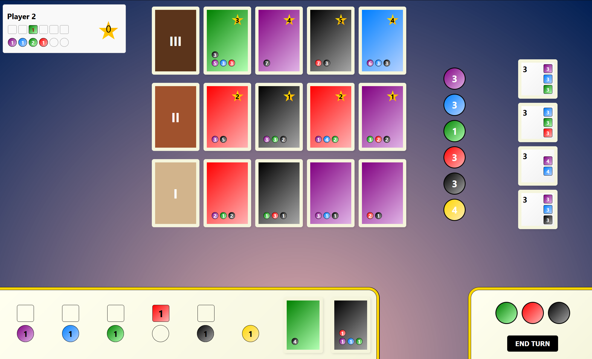

# My Board Game Project

## Descrizione

Questo progetto è un gioco da tavolo online che utilizza un backend basato su FastAPI e un frontend basato su React.

## Struttura del Progetto

- `backend/`: Contiene il codice del server FastAPI.
- `frontend/`: Contiene il codice del frontend React.

## Requisiti

- [Docker Desktop](https://www.docker.com/products/docker-desktop)
- [Node.js](https://nodejs.org/)
- [Python](https://www.python.org/)

## Come Avviare il Progetto

### Utilizzando Docker

1. **Installare Docker Desktop**:
    - Scarica e installa Docker Desktop da [qui](https://www.docker.com/products/docker-desktop).
    - Avvia Docker Desktop e assicurati che sia in esecuzione.

2. **Costruisci e avvia i servizi**:
    - Apri un terminale e spostati nella directory radice del progetto.
    - Esegui il comando:

    ```sh
    docker-compose up --build
    ```

    Questo comando costruirà le immagini Docker per il backend e il frontend e avvierà i container esponendo le porte `3333` per il backend e `3000` per il frontend.

3. **Verifica del Funzionamento**:
    - Apri il browser e vai all'indirizzo `http://localhost:3000?id=1` per accedere all'applicazione React.
    - Il backend sarà accessibile all'indirizzo `http://localhost:3333`.

### Backend

1. Spostarsi nella directory `backend`.
2. Creare un ambiente virtuale e attivarlo:
    ```sh
    python -m venv env
    source env/bin/activate   # Su Windows usa `env\Scripts\activate`
    ```
3. Installare le dipendenze:
    ```sh
    pip install -r requirements.txt
    ```
4. Avviare il server:
    ```sh
    python run_uvicorn.py
    ```

### Frontend

1. Spostarsi nella directory `frontend`.
2. Installare le dipendenze:
    ```sh
    npm install
    ```
3. Avviare l'applicazione React:
    ```sh
    npm start
    ```

### Configurazione dell'URL del Backend

Impostare l'URL del backend nel file `.env` nella directory `frontend`:

```env
REACT_APP_API_URL=http://localhost:3000/api/v1

### Presentazione Interfaccia Utente


